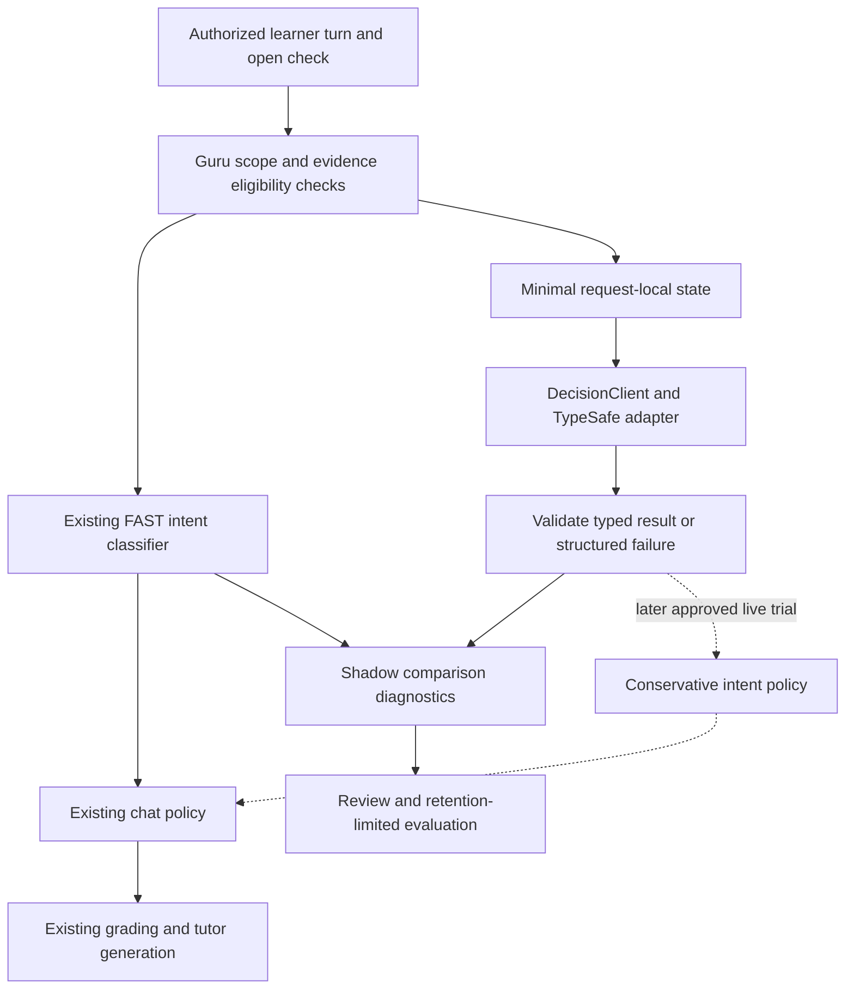

# Proposed Jev architecture for Guru

> **Superseded in part, 2026-09-26.** The implemented design is
> [the Jev turn read](superpowers/specs/2026-09-26-jev-turn-read-design.md). Jev is used as a
> fast first pass in front of the LLM, not only as a substitute for the FAST intent gate: one
> read per turn asks `intent` and `fully_correct`, each switched off / shadow / live on its own
> after a person reads `uv run poe decision-report`. Shadow runs on all traffic, since the
> founder is the only learner. The vendor privacy review is a precondition for inviting anyone
> else (RUNBOOK §14), not for shadow mode. The analysis below remains the background for that
> design.

Date: 2026-09-18. Status: design for review; no runtime integration, provider call, or behavior change implemented. Read alongside [capability evidence](jev-capabilities.md) and [implementation plan](jev-implementation-plan.md). Vendor interface facts and unresolved data-handling questions are recorded in the capability snapshot; the architecture below is a Guru proposal.

## Recommendation and alternatives

Introduce a typed, provider-neutral `DecisionClient` within the existing `app/llm/` boundary, separate from the generative `LLMClient`. First evaluate Jev in shadow mode against the existing FAST conversation-intent gate. This is a replacement opportunity for an existing model call rather than an additional mandatory model step. The first success condition is fewer false learner-evidence attributions with response-quality noninferiority; latency and cost gains follow only if measured against the actual gate.

| Approach | Benefit | Cost/risk | Decision |
| --- | --- | --- | --- |
| Bounded conversation-intent classification | Native finite decisions fit the existing attempt/deferral/withdrawal gate; can target costly false attempts without changing grading. | A false attempt can misattribute ability evidence; shadow mode adds an experimental call and cannot prove causal learning benefit. | Recommended first slice, initially diagnostic only. |
| Prefiltered next tutoring-action selection | Could choose among Guru-owned moves such as hint, worked example, or another check. | Adds a call to deterministic policy; cannot write the chosen explanation; pedagogical effects need a later controlled trial. | Later, after demonstrated task value. |
| Broad LLM-role replacement | Would appear to simplify provider routing. | Jev cannot generate prose, embeddings, tool calls, or explanations; its judgments cannot replace tracer/retention mathematics. | Reject. |

## Ranked opportunity map

This map identifies possible later experiments, not commitments to expand the pilot.

| Rank | Opportunity | Bounded decision | Conditions and exclusions |
| --- | --- | --- | --- |
| 1 | Conversation evidence gate | Which of attempt, deferral, withdrawal best describes the latest reply about the open check? | Preserve evidence/scaffolding rules and fail-to-deferral behavior; no Jev grading in this slice. |
| 2 | Grounding sufficiency and stored-content routing | Are authorized retrieved passages sufficient, or which stored-content category is relevant? | Sources-only context and explicit insufficient-evidence option; no web retrieval or safety guarantee from confidence. |
| 3 | Confirmed concept mapping | Choose a candidate KC from a learner/subject-authorized shortlist or abstain. | Guru validates IDs and taxonomy; use suggestions/review before attaching learning evidence. No invented concepts. |
| 4 | Next teaching move | Select among policy-filtered permissible tutor actions. | Deterministic eligibility first; separate pedagogical evaluation; generative provider realizes any prose. |
| 5 | Inspectable preference hints | Does narrowly scoped evidence support a specific tentative preference suggestion? | Conditional on consent, inspectability, correction and provenance; no inferred learning-style taxonomy or automatic durable profile writes. |
| Excluded | Tutor prose, mastery estimates, FSRS, authorization | None. | Keep generation in LLMClient, education math in learning engine, access policy in Guru. |

## Existing seam and ownership

`app/learning/conversation_evidence.py:80` currently classifies the item stem and latest message using `CHECK_ROLE` (FAST), parses the finite intent, and defaults failures to deferral. `app/services/chat.py:254` calls it from `_resolve_check`; deferral leaves the check open and increments scaffolding, withdrawal clears it without evidence, and an attempt proceeds to the existing grading/evidence path. These are current source observations, not proposed Jev behavior.

The proposed `DecisionClient` owns provider-neutral execution and validated decision results. A TypeSafe adapter alone imports `typesafe_sdk`. A dedicated task/semantic-role setting such as `CONVERSATION_INTENT` selects provider and pinned model; it is proposed configuration, not an existing `ModelRole`. No service, router, or graph node imports the SDK. `app/learning` owns question semantics and policy; chat services own authorization, request context, transitions, and existing grading orchestration. Mastery, FSRS, durable profile/memory and evidence writes remain their current components' responsibilities.

The shadow branch cannot grade an answer, consume a check, increment scaffolding, alter mastery/FSRS, or persist inferred profile/memory. A failed or late shadow request is simply an unavailable diagnostic; FAST continues to govern the turn. Use bounded asynchronous best-effort execution under a reserved experiment budget, skip when capacity/budget is unavailable, and never wait for it to return the learner response. Do not create unbounded detached tasks. Record skipped/unavailable diagnostics to reveal evaluation selection bias.

A bounded process-lifetime supervisor owns shadow tasks and receives only copied immutable minimal data, never request-scoped database sessions or ORM objects. Independent sessions recheck consent, ownership and deletion state before dispatch and record accounting afterward. Expired, revoked, disconnected or late work is skipped/cancelled locally; remote cancellation and refunds are not assumed. The plan specifies how diagnostic suppression and incurred-call accounting remain distinct.

## Minimal contracts and personalization

| Contract element | Proposed meaning |
| --- | --- |
| Task identity | Named intent task with versioned class definitions/instructions and result schema. |
| Request state | Item stem and latest learner reply only; necessary same-check local context can be added only with a documented requirement and budget. No full learner history by default. |
| Model identity | Requested pinned model and returned resolved model recorded separately, alongside SDK version. |
| Choice space | Attempt, deferral, withdrawal with explicit descriptive criteria; Guru owns abstention policy for uncertainty or insufficient evidence. |
| Result | Typed candidate, full validated class probabilities, reported confidence and usage when present, elapsed time, status/failure category. No generated explanation. |
| Local envelope | Correlation ID, learner/subject/check scope, actor and provenance remain local; identifiers need not be transmitted to infer this task. |
| Validation | Required expected answer/type; exact finite class keys; finite, bounded probabilities with a tolerance-checked sum; valid selected class; bounded reported confidence; compatible task/schema/model version. |
| Failure | Distinguish unavailable, timeout, overload, malformed/incomplete, ineligible and abstained; none becomes an attempt. Unknown usage remains unknown. |

Learner-specific state here means Guru passes context for this request. It is not evidence of vendor memory, persistent personalization, model training, or adaptive weights. Jev's distributions describe its judgment of the supplied state; they are not learner mastery probabilities. Task confidence remains an unvalidated vendor statistic until independently evaluated on the task.

## Worked tutor decisions

Suppose the open check asks the learner to explain a step in solving an equation involving division by three. The following are descriptive expected policy outcomes, not measured Jev responses or invented probabilities.

| Learner turn | Intended classification | Guru consequence |
| --- | --- | --- |
| “Why divide both sides by three?” | Deferral: requests help, supplies no answer to the check. | Keep the check; respond with relevant scaffolding; do not grade the request as failure. |
| “I think we divide by three to cancel the plus three.” | Attempt: a partial, possibly wrong proposed answer. | Existing grader determines partial credit and existing scaffolding rules determine evidence independence. Jev does not score mastery. |
| “Please skip this question.” | Withdrawal when clear enough for policy. | Existing server-side explicit skip action, if present, remains authoritative; otherwise intent policy may clear the check without ability evidence. |
| “Maybe, I'm not sure what you're asking.” | Ambiguous; conservative deferral/abstention. | Do not turn uncertainty into a failed attempt. Ask/help through the existing tutor behavior. |

A literal surface question can itself be the learner's answer in another check, so classify the reply relative to the actual item stem, not by punctuation. An incorrect answer is still an attempt; correctness belongs to grading. Withdrawal detection must not invent an explicit server-side skip event.

## Gates, boundaries and fallback

Before inference, authorize the conversation and active item against the learner and subject; check source ownership and actor attribution. Minimal item stems can still contain private source content. Admin/sudo turns default to no Jev call and never become learner evidence. V0 disables web access for everyone; the optional sources-only mode additionally restricts grounding to the learner's selected stored sources. Jev does not retrieve sources or receive tools, and its output cannot grant cross-subject access or authorize adding general knowledge in sources-only mode.

The live proposal has conservative, task-specific gates calibrated from labeled validation data, with asymmetric penalties for false attempts. No arbitrary confidence cutoff is approved here. Ambiguous, incomplete, out-of-scope, unsupported-language, timeout, and provider-error cases resolve conservatively to deferral. Any FAST escalation must be explicitly budgeted and measured; do not silently introduce a second paid call and claim replacement savings. Model judgment never bypasses deterministic authorization or explicit learner actions.

Treat tied top choices as abstention rather than resolving them by label order. For a future tutoring-action selector, Guru filters permissible actions before constructing the question: explicit global/subject preferences, guidance mode, prerequisite eligibility, active attempt, skip/resume state and source scope constrain the candidates. Zero eligible actions uses existing policy; one eligible action needs no model call. Validate the returned action against the current candidates again before applying it, including when state changed while inference was in flight. Jev cannot force a detour, overwrite a learner's edited notes, or silently persist a preference inferred from its own previous decisions.

SDK retry defaults are too broad to serve as the interactive deadline. The adapter needs an explicit end-to-end Guru budget, cancellation handling and circuit-breaker/fallback policy; absence of a vendor cancellation/job API must be respected. Unknown answer types can be silently skipped by SDK 0.6.0, so validate completeness independently. Disable raw DEBUG wire-body logging for learner requests.

## Privacy and lifecycle

Use synthetic or consented, sanitized examples for initial offline evaluation. Real-data shadowing waits for the provider agreement, data-retention/deletion and eligible account settings to be resolved. No-training commitments do not imply standard zero retention. Enterprise ZDR is not a default account guarantee. Never transmit credentials, unnecessary personal identifiers, the full learner profile, or raw unrelated conversation history.

Own a diagnostic provenance/deletion ledger so trial records can be located by learner/source without retaining raw text by default. [V0_DECISIONS.md](V0_DECISIONS.md) V12 accepts initial configurable 30-day diagnostic/backup retention while durable learning artifacts remain until explicit deletion; account access disables immediately with a seven-day recovery window and erase-now path. These are Guru decisions, not vendor purge guarantees. Provider deletion obligations and backup purge must be resolved separately before promising end-to-end deletion.

## Evidence required before live behavior

Independent human labels on held-out replies establish attempt/deferral/withdrawal truth; the actual FAST gate is a comparison baseline, not ground truth. Include help requests, partial incorrect attempts, ambiguous turns, withdrawal, multilingual examples, adversarial text, and long-context cases. Report false-attempt attribution separately from aggregate agreement, along with response-quality noninferiority and abstention coverage. Calibrate distributions and gates against labels, by model/task version; raw confidence or score alone is not calibration evidence.

Measure real end-to-end regional latency, including retries, fallback, queueing and missed deadlines; record call counts, model identity, token usage and invoiced cost. Shadow mode intentionally adds experimental cost; live replacement savings must include escalation calls. Missing billing metadata cannot be counted as zero cost. Verify zero forbidden side effects in shadow mode and admin/source rejection paths.

Shadow comparisons cannot show improved retention or teaching effectiveness. A later opt-in randomized behavior trial is required for causal downstream benefit, with learner-evidence correctness and response quality protected before optimizing throughput.

Before any real-data shadow run, resolve privacy and caller/source authorization; the active-item fetch must not authorize a cross-learner or cross-subject stem by assumption. Intent-only read-only shadowing need not wait for unrelated flashcard evidence repairs if it neither consumes contaminated mastery features nor uses their outcomes as labels. Studies of ability, policy, or downstream learning do depend on resolving generated-item assessability/global-item eligibility and self-rated versus independently graded evidence semantics, including any required recomputation. These dependencies are not fixes implemented by this design. Synthetic adapter smoke checks can proceed independently.

## Decisions to settle during future execution

These are proposed responsibilities, not new approval requests for this documentation task.

| Open decision | Verification and completion condition | Owner |
| --- | --- | --- |
| Account model availability and data handling | Confirm pinned model access, applicable agreement, retention/purge, deletion process and any ZDR entitlement before exporting learner text. | Maintainer/account owner with TypeSafe |
| Intent promotion rule | Define class labels, ambiguity handling, false-attempt tolerance, attempt-recall and false-withdrawal safeguards, and sample size before examining held-out results; report uncertainty intervals, not just a point estimate. | Maintainer acting as evaluation owner, with an independent label reviewer |
| Operational envelope | Set request-size, parallelism, request-count and spending caps plus local deadline from a budgeted synthetic measurement; demonstrate cancellation, overload and missing-usage behavior. | Implementer with maintainer-set spending limit |
| Evidence repair scope | Identify contaminated historical observations, recompute affected ability traces where required, and version the corrected policy before using those traces to claim learning benefit. | Guru learning-engine maintainer |
| Broader personalization benefit | Predefine delayed independently graded retention/transfer outcomes and stopping rules; randomize an opt-in behavior trial, control for baseline ability and repeated-item exposure, and report inconclusive results honestly. | Evaluation owner |
